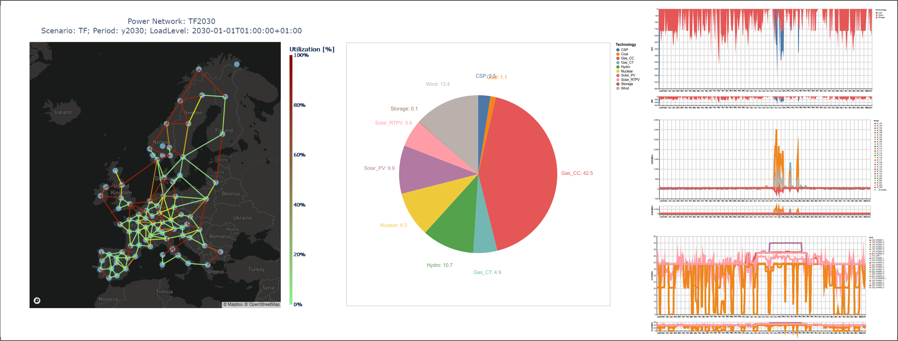

# openTEPES-tutorial
openTEPES' Exploratory Execution 

We are glad to welcome you to the openTEPES-tutorial! Here you will find some material that will help you to interact easily and explore the main functionalities of the openTEPES model. 

An overview of the content can be found at [notebooks/Index.ipynb](notebooks/Index.ipynb).

The detailed information about the model is on [readthedocs](https://opentepes.readthedocs.io/en/latest/index.html).

[comment]: <> (The workshop was recorded and is available [on YouTube]&#40;https://www.youtube.com/watch?v=ms29ZPUKxbU&#41;)

This tutorial has been made into a jupyter notebook and is hosted at .

## Run the Tutorial

The tutorial can be run in Binder: .